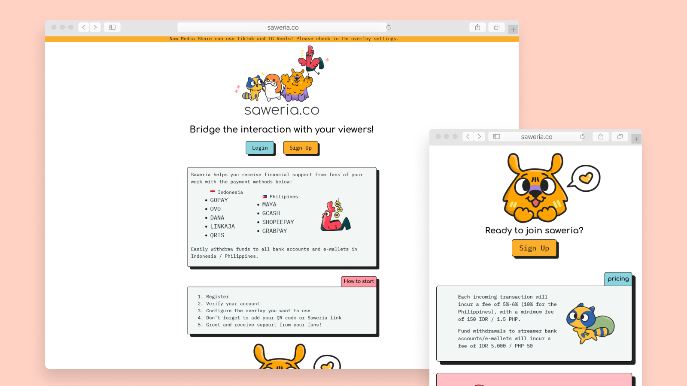

# Saweria – Frontend (Freelance Project)

## 🧭 Overview

**Saweria** is a platform that helps creators connect directly with their fans and build sustainable communities.  
As a freelance frontend developer, I contributed to delivering a seamless and engaging user experience using modern web technologies. The site equips creators with tools to grow their audience and monetize effectively.

🔗 **[Visit Saweria](https://saweria.co/en)**



---

## ✨ Features

- **Creator-Focused Tools**  
  Intuitive features to engage and grow creator communities.

- **Responsive Design**  
  Optimized for desktop and mobile for broad accessibility.

- **Interactive UI Components**  
  Built with Radix UI and Tailwind CSS for a polished, consistent interface.

- **Customizable & Scalable**  
  Modular code structure supports future enhancements.

- **QR Code Integration**  
  Payment workflows using `react-qr-code`.

---

## 🛠 Tech Stack

- **Framework & Language**: Next.js, TypeScript
- **Styling**: Tailwind CSS, Tailwind CSS Animate
- **UI Components**: Radix UI, ShadCN
- **Tooling**: ESLint, PostCSS, Autoprefixer
- **Runtime**: Node.js 20.3.1, React 18.2.0

---

## 🔍 Routes

- `/login` – User login page
- `/register` – User registration page
- `/admin` – Admin dashboard
- `/admin/integrations` – Admin integrations management
- `/transactions` – Overview of user transactions
- `/transactions/outgoing` – Outgoing transaction details
- `/transactions/cashout` – Cashout transaction management
- `/overlays` – Creator overlay customization
- `/profile` – User profile management
- `/faq` – Frequently asked questions
- `/[username]` – Dynamic creator profile pages

---

## 📁 Project Structure

Built with Next.js using a modular structure for scalability and maintainability.

```bash
saweria.co/
├── components/      # Reusable UI components
│   ├── overlays/    # Overlay components
│   └── ui/          # General UI elements
├── constants/       # Static values and configuration
├── design/          # Design assets and mockups
├── layouts/         # Shared page layouts
├── lib/             # Utilities and helpers
├── pages/           # App routes (Next.js)
├── public/          # Static assets (e.g., images)
├── styles/          # Global and theme styles
└── ...              # Config files (ESLint, Tailwind, etc.)
```

---

## 🚀 Getting Started

### Prerequisites

- Node.js ≥ 18
- Yarn or npm

### Installation

```bash
git clone https://github.com/hasansujon786/saweria.co
cd saweria.co
yarn install
yarn dev
```

Open `http://localhost:3000` in your browser.

---

## 🧾 Portfolio Note

This project is part of my developer portfolio and showcases my ability to craft modern, responsive frontend applications.
It reflects my work as a freelance frontend engineer and my commitment to performance, usability, and scalable code.

Feel free to explore the code — and reach out if you're hiring or interested in collaboration!

---

## 📬 Contact

- **GitHub**: [github.com/hasansujon786](https://github.com/hasansujon786)
- **Email**: [hasansujon786@gmail.com](mailto:hasansujon786@gmail.com)
- **Portfolio**: [hasansujon786.github.io](https://hasansujon786.github.io)

---

## 🛡 License

This project is licensed under the **Creative Commons Attribution-NonCommercial 4.0 International License (CC BY-NC 4.0)**.  
You’re welcome to learn from or adapt the code for personal or educational use — but commercial use is not permitted.

🔗 [View License](https://creativecommons.org/licenses/by-nc/4.0/)
